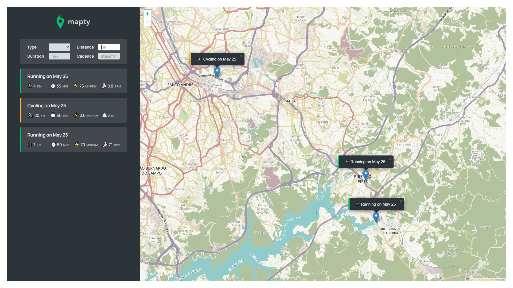

# Mapty

A web application, built in Typescript and JQuery, to keep track of your workouts. This was developed during my enroll on the Jonas Schmedtmann's [JavaScript course](https://www.udemy.com/course/the-complete-javascript-course/ 'Course page on Udemy').

## About

Mapty is a web application to keep track of information about your workouts like type, location, duration and more. It includes an interactive map (implemented with the [Leaflet library](https://leafletjs.com/)) which can be used to mark and display the location of the workouts (which currently can be runnings or cyclings).

## Requirements

-   Nodejs `v16.14.0`;
-   NPM `v8.3.1`.

## Run locally

In order torun this project locally, run the following commands:

-   Clone this repository with `git clone https://github.com/William-Fernandes252/Bankist.git`;
-   Install the dependencies with `npm install`;
-   And whenever you want to build the project, run `npm run build`;
-   Also, you can try login with one of the accounts defined in the data module with it's username and pin (like 'wf' and '1111', for example).
